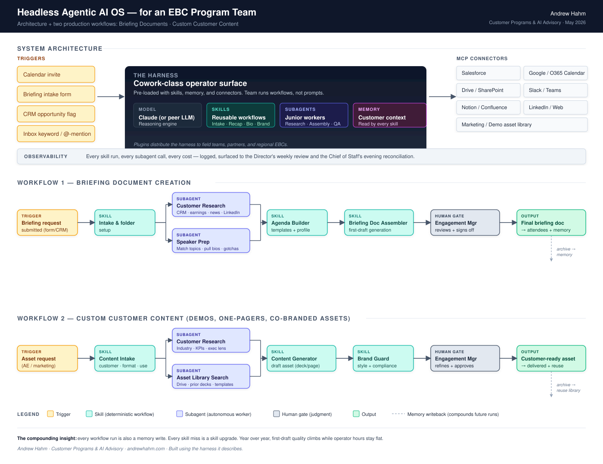

# EBC AI Deployment Kit

A working set of artifacts for executive briefing teams deciding where to apply AI, and where not to.

Most briefing programs I talk to are somewhere between "we should probably be doing something with AI" and a stalled pilot that impressed once and never entered daily use. The gap is rarely the model. It is that the inputs are scattered, every brief is rebuilt from scratch, and nobody has said out loud who signs off before something reaches a customer.

This kit is the frame I use for that conversation, published so other people can take it apart and argue with it.

**[Run the readiness assessment →](assessment/)**

---

## The operating principle

**Standardize the content, customize the conversation.**

An executive briefing has two halves that get confused with each other. There is the assembly: pulling the account history, researching the attendees, checking what changed at the company in the last ninety days, building the agenda scaffold, writing the recap. Then there is the judgment: knowing what this particular customer needs to hear, which executive should take which part of the room, when to abandon the agenda because the conversation went somewhere better.

The assembly is where the hours go. The judgment is where the value is. Most briefing leads spend their week on the first and defend the second in whatever time is left over.

AI should take the assembly tax and leave the judgment alone. A deployment that gets this backwards produces briefings that are faster and worse, which is the outcome that ends AI programs inside a company for about three years.

## The boundary

| Automate first | Keep human |
|---|---|
| Account snapshots and recent-signal research | What this specific customer actually needs to hear |
| Attendee background synthesis from public sources | Which executive takes which part of the room |
| Agenda scaffolding from a known meeting type | Reading the room and changing course mid-meeting |
| Post-meeting recap drafting and action extraction | Any commitment made on the company's behalf |
| Asset lookup across the content library | Final sign-off on anything the customer sees |

The right-hand column is not a temporary limitation waiting for better models. It is the job. A briefing program that automates the right-hand column has automated away the reason the briefing center exists.

## What determines whether this works

Five things, in rough order of how often they are the actual blocker:

**Input readiness.** Whether the information an AI would need is reachable and current. Scattered intake and un-searchable prior briefs defeat any tool placed on top of them.

**Repeatability.** Whether the work is standardized enough that a machine can learn its shape. If every brief is bespoke, there is no pattern to encode and every output needs heavy rework.

**Human gates.** Whether it is clear who reviews what. Ambiguous review is where adoption dies quietly, usually after one embarrassing draft reaches an executive.

**Measurement.** Whether you could tell if it worked. You cannot defend an investment you never baselined, and "the exec liked it" does not survive a budget review.

**Team and ownership.** Whether one person owns this with protected time. Programs without a named owner become shelfware regardless of tooling quality.

The [readiness assessment](assessment/) scores a program on all five and returns a ranked set of first moves. It runs entirely in the browser, stores nothing, and sends nothing anywhere.

## Architecture

What the automated half looks like when it is built properly. Note the human gate before output, which is the part most reference architectures leave off.

Two things worth pointing at. **Observability** is a first-class component rather than an afterthought, because a briefing director who cannot see what the system did and what it cost cannot defend it. And the connectors are deliberately boring: calendar, CRM, document store, chat, the asset library. The interesting part of this architecture is not the model. It is that the team runs workflows instead of writing prompts.

## Contents

| | |
|---|---|
| [`assessment/`](assessment/) | The readiness assessment. Self-contained HTML, no dependencies, no build step. Open it locally or deploy it anywhere static. |
| [`architecture/`](architecture/) | The reference architecture diagram as SVG. |
| [`skills/`](skills/) | A worked example: the design spec for an automated briefing-prep step, including the failure modes it is built against. |

## On the worked example

[`skills/executive-briefing-prep.md`](skills/executive-briefing-prep.md) is a **specification, not a running tool.** It is published as a design artifact because the interesting content is the failure-mode section, not the feature list. Anyone can list what a briefing generator should output. The harder question is what it does when there is no public signal on an attendee, and the answer has to be "says so" rather than "invents something plausible."

I would rather publish an honest spec than imply a capability that does not exist yet.

## Using this

Take it, fork it, change the questions, disagree with the boundary. The assessment is generic on purpose so that a team can adapt it to how their program actually runs.

If you run a briefing program and want to talk about any of this, I am at [andrewhahm.com](https://andrewhahm.com).

## License

[MIT](LICENSE)
